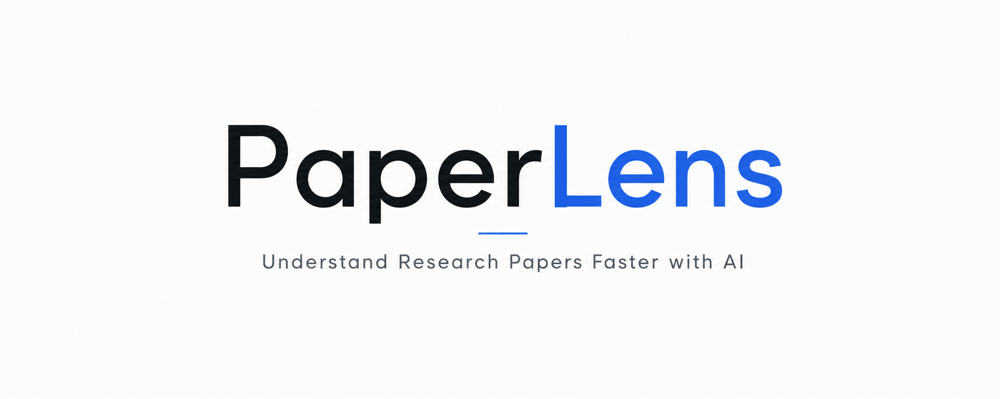

<p align="center">
  
</p>

# PaperLens

**Research paper analysis tool** — upload a PDF, get structured summaries, key findings, and a plain-English explanation.

PaperLens extracts text from a research paper via [PyMuPDF](https://pymupdf.readthedocs.io/), sends it to an LLM provider (OpenAI, Gemini, or local Ollama), and returns:

- **Executive Summary** — high-level overview (2–3 paragraphs)
- **Key Findings** — 5 major takeaways as bullet points
- **Methodology** — description of the methods used
- **Conclusion** — summary of conclusions
- **Keywords** — 5–10 important terms
- **Simple Explanation** — ≤300 words aimed at a motivated high-school student

Results can be downloaded as a Markdown report.

---

## Architecture

```
paperlens/
├── app/
│   ├── main.py                  FastAPI application (CORS, lifespan, static mount)
│   ├── config.py                Environment-based config via pydantic-settings
│   ├── database.py              SQLite CRUD for paper records
│   ├── exceptions.py            Custom error classes
│   ├── models/
│   │   └── paper.py             Pydantic models for all data shapes
│   ├── ai/
│   │   ├── base.py              Abstract AI provider interface
│   │   ├── factory.py           Provider factory (openai | gemini | ollama)
│   │   └── providers/
│   │       ├── openai.py        OpenAI (AsyncOpenAI SDK)
│   │       ├── gemini.py        Google Gemini (direct HTTP)
│   │       └── ollama.py        Local Ollama (direct HTTP)
│   ├── services/
│   │   ├── pdf_parser.py        Text extraction, title/abstract heuristics
│   │   ├── summarizer.py        Structured summary + simple explanation
│   │   ├── keyword_extractor.py Keyword extraction
│   │   └── report_generator.py  Markdown report generation
│   └── api/
│       └── routes.py            REST endpoints
├── frontend/
│   ├── landing/                 Primary React UI (dark theme, drag-drop upload)
│   │   ├── src/
│   │   │   ├── components/
│   │   │   │   ├── Navbar.jsx
│   │   │   │   ├── Hero.jsx         Upload zone, progress, success states
│   │   │   │   ├── FeaturesSection.jsx
│   │   │   │   ├── HowItWorks.jsx
│   │   │   │   ├── SetupGuide.jsx    Provider config & API key instructions
│   │   │   │   ├── DashboardPreview.jsx  Real analysis results display
│   │   │   │   └── Footer.jsx
│   │   │   └── App.jsx
│   │   ├── package.json
│   │   └── vite.config.js
│   └── streamlit_app.py         Legacy Streamlit UI (optional)
├── tests/
│   ├── test_pdf_parser.py
│   ├── test_report_generator.py
│   ├── test_database.py
│   └── test_upload.py           API upload E2E tests
├── pyproject.toml
├── .env.example
├── setup.sh                     One-command setup
└── run.py                       Launch script
```

### Design decisions

- **AI provider abstraction** — the LLM provider implements a 3-method ABC (`generate`, `name`, `is_available`). The summarizer and keyword extractor never import an SDK directly. Adding a new provider means writing one class and registering it in the factory.
- **React landing page as primary UI** — built with Vite + Tailwind, served by FastAPI at `/`. No separate frontend server needed. Analyses are triggered directly from the browser via `fetch('/api/upload')`.
- **Stateless services** — every service receives a provider instance; nothing is hard-wired to a specific model.
- **Dark-mode design** — consistent purple-accented theme across all pages.

---

## Quick start

### Prerequisites

- Python ≥ 3.12
- [uv](https://docs.astral.sh/uv/) (package manager)
- Node.js ≥ 18 (for building the landing page)

### Setup (30 seconds)

```bash
git clone https://github.com/pr-hari-jayanth/PaperLens.git
cd PaperLens
bash setup.sh                          # creates .env, installs deps, builds landing page
# then edit .env with your API key
uv run python run.py                   # starts the backend
```

Open **http://127.0.0.1:8000** in your browser — the landing page is served directly by the API.

### Configuration

Only **one** AI provider is needed. Edit `.env`:

```ini
AI_PROVIDER=openai
OPENAI_API_KEY=sk-...
```

Or for Ollama (no API key needed):

```ini
AI_PROVIDER=ollama
OLLAMA_MODEL=llama3.2
```

A **Setup Guide** section is also available inside the app itself (click "Setup" in the navbar) with direct links to API key pages and a live `.env` preview.

### Legacy Streamlit UI

A Streamlit-based UI from earlier versions is still available:

```bash
uv run python run.py --legacy-ui       # starts API + legacy Streamlit on :8501
```

---

## API endpoints

| Method | Path | Description |
|--------|------|-------------|
| `POST` | `/api/upload` | Upload a PDF for analysis (multipart/form-data) |
| `GET`  | `/api/papers` | List all previously analysed papers |
| `GET`  | `/api/papers/{id}` | Full details for a single paper |
| `GET`  | `/api/reports/{path}` | Download a Markdown report file |

### Upload example

```bash
curl -X POST http://127.0.0.1:8000/api/upload \
  -F "file=@paper.pdf"
```

---

## Testing

```bash
uv sync --extra dev
uv run pytest tests/ -v
```

---

## Roadmap

- **Phase 2** — paper comparison, flashcard generation, citation extraction, PowerPoint export, research timelines
- **Phase 3** — batch processing, PDF annotation overlay, multi-user support

---

## License

MIT
